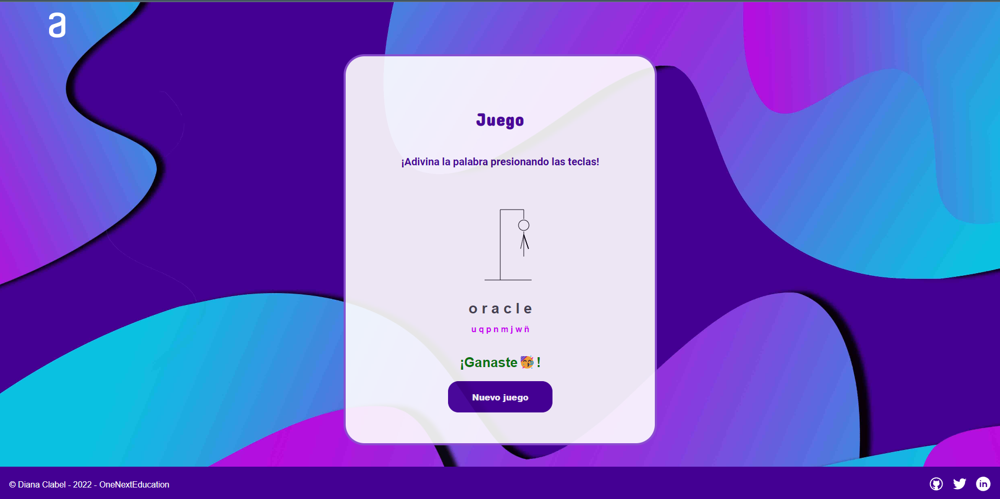

# Juego Ahorcado

Juego Ahorcado para Challange nº2 de Alura Latam - Oracle ONE

## Lenguajes

HTML, CSS, JS

## Descripción

El desafío consiste en construir una página web que contenga el juego del ahorcado, se presenta un menú inicial donde se puede elegir entre iniciar el juego o añadir una palabra a la lista. El juego consiste en presentar un palabra oculta que se irá descifrando a medida que el usuario seleccione una letra, si la letra forma parte de la palabra se mostrará su posición en la palabra y las veces que aparece, si en caso contrario la letra no pertenece a la palabra se pierde un intento y comienza a dibujarse al ahorcado, la cantidad de intentos posibles son hasta que la figura se complete, en total son 9 intentos, si la figura se completa se pierde el juego pero si completan la palabra antes de completar la figura el juego se gana.

## Requisitos:

- Al completar o dibujo de la horca, debe ser mostrado un mensaje "Perdiste" en la pantalla;
- Si se completa la palabra correcta antes de que se acaben los intentos, debe ser mostrado un mensaje de "Ganaste" en la pantalla.
- La página debe tener los guiones indicando cada letra da palabra, separados por un espacio;
- Para comenzar el juego la página debe tener un botón de "Iniciar Juego";
- Las letras equivocadas deben aparecer en la pantalla, pero no pueden aparecer de forma repetida;
- Las letras correctas deben aparecer en la pantalla encima de los guiones, en la posición correcta em relación a la palabra.
- (EXTRA) La página debe tener un campo para inserción de texto con la finalidad de adicionar nuevas palabras al juego, e un botón "Agregar palabra".
